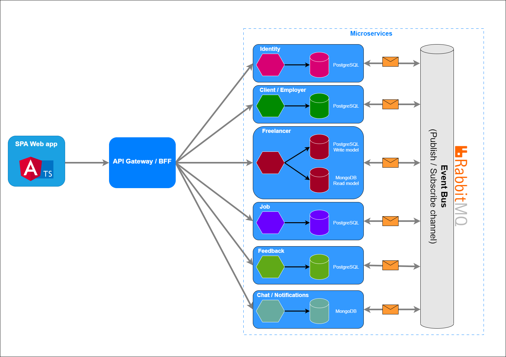

# Freelancer platform
Freelancer platform is a Minimal Viable Product (MVP) developed for educational purposes. This project is a freelance job marketplace platform designed to demonstrate the implementation of microservices within the .NET ecosystem. It allows clients to post jobs and hire freelancers, while freelancers can showcase their skills and experiences, browse available jobs, and submit proposals.

<i><b>Note:</b> The primary intent of this project is to serve as a learning resource for understanding and implementing microservices in .NET. As such, while it does possess the functionality of a freelance platform, it may not include all the features found in a fully-fledged commercial product.</i>

## Architecture overview
Each function of the platform is decoupled into several autonomous microservices, each with their own data and isolated responsibilities.

Each microservice in our architecture has its own implementation approach. Some services follow a simple CRUD model (also known as the anemic domain model), while others are designed using Domain-Driven Design (DDD) and Command Query Responsibility Segregation (CQRS) patterns.

Communication between microservices is achieved asynchronously using an event bus, with RabbitMQ as the underlying messaging system. This ensures that all our services can communicate effectively and that they remain loosely coupled, promoting a more maintainable and resilient system architecture.

The following diagram provides an rough overview of the architecture:

## Services

### Identity
The Identity Service serves as a centralized hub for managing authentication and authorization. This crucial service is built on top of the <b>IdentityServer4</b> framework and utilizes <b>ASP.NET Identity</b> for user management.

### ClientProfile/Employer
The Client profile/Employer service is a simple service for client/employer profile management.

### Freelancer
The Freelancer Service manages the profile details of freelancers, including profile summaries, education, certifications, employment history, ...
It's built using <b>Domain-Driven Design (DDD)</b> principles, <b>Clean Architecture</b>, and the <b>CQRS</b> pattern.
To get faster reads <b>MongoDB</b> is used for read model, profiles are aggregated into single document.

### Job
The Job Service orchestrates the job pipeline: job creation, proposal submission, acceptance of a proposal (contract creation), to finalizing the job.
It's built using <b>Domain-Driven Design (DDD)</b> principles, <b>Clean Architecture</b>, and the <b>CQRS</b> pattern.

### Feedback
The Feedback Service allows clients and freelancers to provide feedback upon completion of a contract.

### Chat/Notifications
Service that provides simple chat and notification system. 
It's built using <b>SignalR</b> for real-time communication and <b>MongoDB</b> for data storage.
